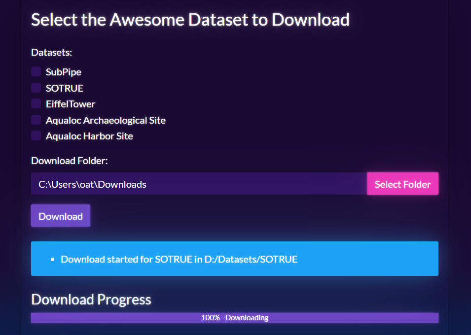

# awesome_slam_dataset_downloaders

A curated collection of **SLAM-related datasets** together with **ready-to-use Python scripts** to download and extract them quickly and consistently on your local machine.

The goal of this repository is to:
- Centralize links to high-quality SLAM datasets
- Provide **reproducible download scripts**
- Avoid manual clicks, broken links, and ad-hoc extraction steps
- Serve as a lightweight utility repo that can be reused across projects

---

## Supported Domains
- Visual SLAM
- Visual–Inertial SLAM
- Underwater SLAM
- Multi-session / long-term mapping datasets

---

## Underwater Datasets

| Dataset                                                              | Pose GT | Image Frames |
|----------------------------------------------------------------------|---------|--------------|
| [**AQUALOC**](https://www.aqualoc.org/)                              | yes     | yes          |
| [**SubPipe**](https://github.com/remaro-network/SubPipe-dataset)     | yes     | yes          |
| [**EiffelTower**](https://www.seanoe.org/data/00810/92226/)          | yes     | yes          |

### Dataset Notes
- **AQUALOC**  
  Large-scale underwater visual SLAM dataset with archaeological and harbor scenarios.  
  Provides camera trajectories, raw images, and challenging lighting/turbidity conditions.

- **SubPipe**  
  Pipeline inspection dataset focused on structured underwater environments with ground truth trajectories.

- **EiffelTower**  
  Multi-year underwater survey dataset (2015–2020) around the Eiffel Tower foundations.  
  Suitable for long-term SLAM, temporal change analysis, and relocalization.

---

## Repository Structure

```text
awesome_slam_dataset_downloaders/
├── utils/
│   ├── download_utils.py     # Generic download + extraction utilities
│   └── __init__.py
├── source/
│   ├── aqualoc.py
|   ├── eiffel_tower.py
│   └── subpipe.py
├── scripts/
├── requirements.txt
└── README.md
```

---

## Web Downloader Interface



A simple web interface is included for selecting and downloading datasets interactively.

### Features
- Select one or more datasets to download using checkboxes
- Choose the local download folder using a folder picker
- See real-time download progress, including file name and percentage
- Stop downloads at any time
- Uses the Vapor theme from Bootswatch for a modern look

### How to Run

1. **Install dependencies**
   ```powershell
   pip install -r requirements.txt
   ```

2. **Start the web downloader**
   ```powershell
   python web_downloader.py
   ```

3. **Usage**
   - The web interface will open automatically.
   - Select datasets and a download folder.
   - Click "Download" to start.
   - Monitor progress and stop downloads if needed.

> **Note:** The interface is cross-platform and works on Windows, macOS, and Linux.

---
